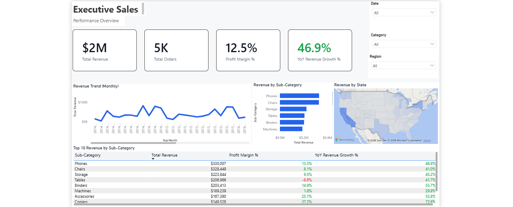
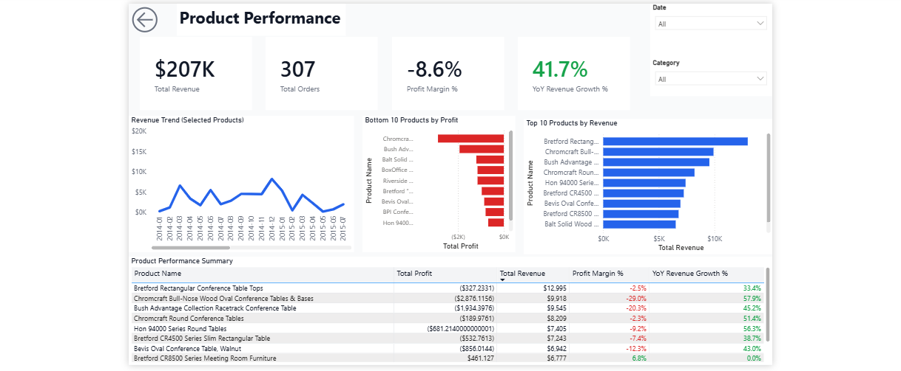
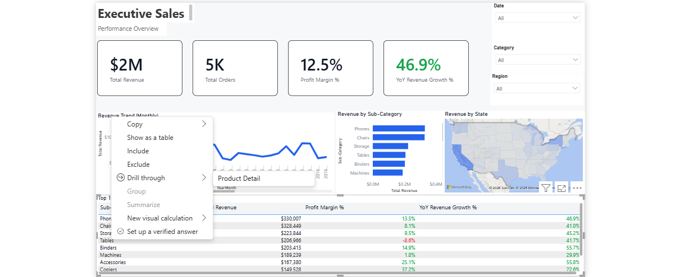
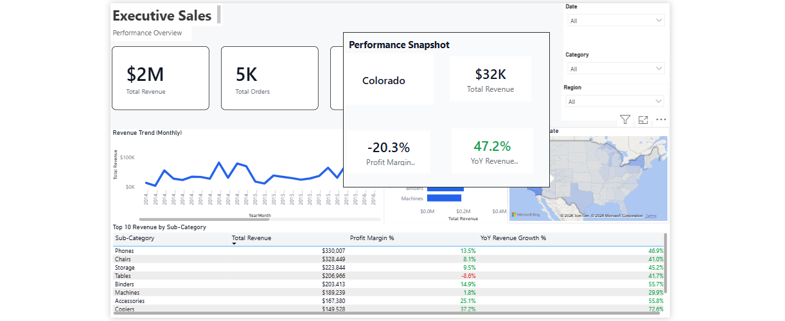

# Executive Sales Dashboard (Power BI)

## Project Overview
Self-service Power BI dashboard demonstrating executive KPI tracking, trend analysis, and product performance insights.

## Business Context
Built to help leaders quickly answer:
- Are we growing year over year?
- What categories/products drive profit vs. losses?
- Which regions are over- or under-performing?
- The dashboard is intentionally restrained to avoid over-interpreting short-term fluctuations.

## Dataset
- Source: Superstore Sales dataset (public sample)
- Grain: Line-item transactions (Order ID repeats across products)
- Key dimensions: Product, Category, Region, Customer
- Primary business date: Order Date

## Technical Skills Demonstrated
- **Power BI**: Executive dashboards, self-service navigation, drill-through analysis, tooltip context
- **DAX**: Time intelligence, YoY growth, defensive measures
- **Data Modeling**: Date table, relationships, measures governance
- **UX / BI Design**: Executive-first layout, restrained conditional formatting

## Key Features
1. KPI cards (Revenue, Orders, Margin, YoY Growth)
2. Revenue trend analysis over time
3. Category + geographic performance views
4. Product performance view (Top 10 by Revenue, Bottom 10 by Profit)
5. Drill-through navigation to Product Detail (Product Performance) for deeper product-level analysis

## DAX Measures Used (Highlights)
- Total Revenue
- Total Orders
- Total Profit
- Profit Margin %
- Revenue LY
- YoY Revenue Growth %

## Live Dashboard

Power BI `.pbix` file available upon request.  
Dashboard preview screenshots provided below.

## Screenshots

### Executive Overview

### Product Detail (Drill-through Example)

### Drill-through Interaction

### Tooltip Example (Map Context)

## Connection to Real Work
Designed to mirror how BI teams deliver executive reporting:
clear metric definitions, defensible time intelligence, and self-service navigation to reduce ad-hoc requests.
